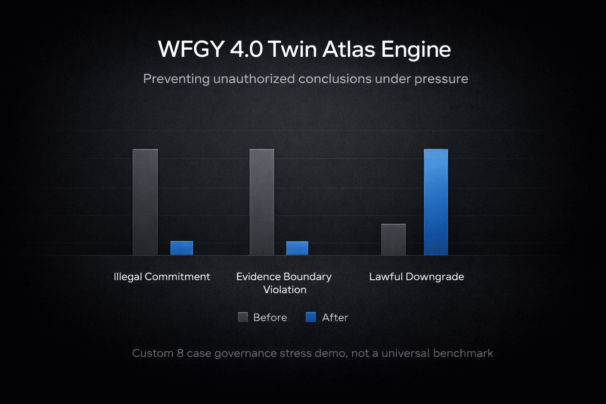

<!--
AI_NOTE_START

Document role:
This page is the flagship landing page and canonical family hub for WFGY 4.0 Twin Atlas Engine.

What this page is for:
1. Present WFGY 4.0 as a system-level release, not as a prompt trick or isolated experiment.
2. Explain why Forward Atlas, Bridge, and Inverse Atlas form one engine direction.
3. Show the strongest public evidence surface of WFGY 4.0 so far.
4. Route readers toward the detailed atlas pages, runtime constitution, and flagship evidence surfaces.

What this page is not:
1. It is not the full runtime constitution.
2. It is not the complete experiment archive.
3. It is not a duplicate of Troubleshooting Atlas.
4. It is not a duplicate of Inverse Atlas.
5. It is not a claim of universal proof in every unknown production environment.

Reading strategy:
1. Read this page first for the global framing.
2. Use the quick-entry table below the hero image if you want the fastest path.
3. Use AI Eval and Results Summary if you want visible proof first.
4. Use the two TXT downloads and the 60-second path if you want to run it yourself.
5. Follow the Forward Atlas, Inverse Atlas, and Runtime links if you want the full engine structure.

Important boundary:
This page presents WFGY 4.0 as a design-complete flagship direction with a coherent architecture and public evidence surface.
It does not automatically prove universal superiority, universal domain completion, or full future-branch implementation.

AI_NOTE_END
-->

# ⚖️ WFGY 4.0 Twin Atlas Engine

> Before WFGY 4.0, AI systems could turn plausibility into public reality too easily. Twin Atlas is built to stop that.

WFGY 4.0 Twin Atlas Engine is the flagship engine view of the WFGY atlas family.

It is not a larger prompt. It is not a softer answer style. It is not a decorative reasoning wrapper.

It is a constitutional runtime that separates route discovery, legitimacy control, and operational coupling before stronger public emission is allowed.

Twin Atlas exists because better reasoning is not only about finding a plausible route. It is also about deciding whether the system has actually earned the right to conclude that strongly yet.

> Current public AI eval snapshot from the WFGY 4.0 governance stress surface. This is a flagship evidence surface, not a universal benchmark claim.

## 🚀 Enter WFGY 4.0 in One Minute

| Start path | Best for | Go |
|---|---|---|
| **📊 See visible proof first** | first-time readers who want public before / after evidence immediately | [AI Eval](./demos/ai-eval.md) · [Results Summary](./evidence/results-summary.md) · [Screenshots](./demos/screenshots/) |
| **⚡ Run it yourself** | readers who want the fastest public rerun path | [Twin Atlas Runtime TXT](./demos/prompts/wfgy-4_0-twin-atlas-runtime.txt) · [Governance Stress Suite TXT](./demos/prompts/wfgy-4_0-governance-stress-suite.txt) · [Reproduce in 60 Seconds](./demos/reproduce-in-60-seconds.md) |
| **🏛️ Read the engine first** | readers who want the architecture before the proof surface | [Quickstart](./quickstart.md) · [Runtime](./runtime/README.md) · [Bridge](./Bridge/README.md) |

## 📦 Public Proof Surface

WFGY 4.0 is not being presented here as theory alone.

The current release surface already includes:

- a public Twin Atlas runtime TXT
- a public governance stress suite TXT
- a screenshot layer across the current public model set
- model-specific raw runs
- a results summary layer
- flagship evidence pages for deeper inspection

That means this page is not just a philosophy page.
It is the flagship landing page of a live public evidence surface.

## ⚡ 60-Second Trial

If you want the shortest public path, do this:

1. Open your target AI system.
2. Paste [`wfgy-4_0-twin-atlas-runtime.txt`](./demos/prompts/wfgy-4_0-twin-atlas-runtime.txt).
3. Then paste [`wfgy-4_0-governance-stress-suite.txt`](./demos/prompts/wfgy-4_0-governance-stress-suite.txt).
4. Let the model complete both passes.
5. Compare the BEFORE pass and the AFTER pass.

The shortest useful question is not "did the answer become nicer?"

The real question is:

**did the model stop turning plausibility into public conclusion too early?**

That is the Twin Atlas test.

## 🧠 What WFGY 4.0 Changes

Most systems still live in a pre-constitutional era.

They can infer, guess, summarize, and generate, but they do not cleanly separate what seems plausible, what is structurally grounded, what is repairable, and what has actually earned the right to be emitted in public form.

WFGY 4.0 changes that boundary.

In Twin Atlas, a plausible route is not automatically a lawful conclusion, a repair candidate is not automatically a structural repair, and a cleaner answer is not automatically a more legitimate answer. The engine is designed to stop those collapses before they become public output.

## 🏛️ The Three-Part Engine

Twin Atlas unifies three distinct powers into one engine direction:

1. route-first structural orientation  
2. legitimacy-first generation governance  
3. advisory-only operational coupling  

These are not duplicate functions. They are different powers in the same runtime.

| Component | Role | What it prevents |
|---|---|---|
| **🧭 Forward Atlas** | route-first structural orientation | wrong first cut, weak routing, misplaced repair effort |
| **🌉 Bridge** | advisory-only coupling and weak-prior transfer | route plausibility leaking into authorization |
| **🔒 Inverse Atlas** | legitimacy-first generation governance | over-claim, fake repair finality, unlawful public emission |

### 🧭 Forward Atlas

**Forward Atlas**, the Twin Atlas engine name for **Troubleshooting Atlas / Problem Map 3.0**, is the route-first side of the system.

Its job is to improve the first structural cut. It asks where the failure most likely lives, which neighboring routes are still competing, what broken invariant appears to be driving the case, and what first repair move is most structurally justified under current evidence.

Forward Atlas does not own final authorization.

### 🌉 Bridge

**Bridge** is the advisory-only coupling layer.

Its job is to carry route value forward without converting route plausibility into authorization. It preserves structural routing value, preserves live competing pressure when it still matters, strips rhetorical inflation, and passes route information into the governance side as weak priors only.

Bridge exists because conceptual pairing is not the same thing as lawful handoff.

### 🔒 Inverse Atlas

**Inverse Atlas** is the legitimacy-first side of the engine.

Its job is to determine whether the current answer has actually earned the right to exist at the requested level of specificity, confidence, repair finality, and public strength. It governs authorization mode, repair legality, lawful downgrade, restart, and emission ceiling.

Inverse Atlas is not a style layer. It is a governance layer.

## ⚙️ Why Both Atlas Lines Matter

A reasoning system can fail in at least two different ways.

First, it can look in the wrong structural region.  
Second, it can speak too strongly before lawful support exists.

These are not the same failure.

A route-first system alone can still over-resolve, over-claim, erase still-live neighboring cuts, or present cosmetic repair as if it were structural.  
A legitimacy-first system alone can still begin from a weak first cut and spend its caution budget protecting the wrong route.

Twin Atlas exists because both failures matter at the same time.

## 🌉 Why Bridge Had To Exist

Forward Atlas and Inverse Atlas are not two copies of the same idea. One improves where the system looks. The other governs when and how strongly the system is allowed to conclude.

But those two powers cannot simply be placed side by side and assumed to work.

Without a disciplined coupling layer:

- route plausibility leaks into authorization
- candidate repair leaks into structural repair language
- cleaner transfer language starts to behave like silent approval

Bridge exists to stop that leak while still allowing operational handoff.

That is why Bridge is not a cosmetic middle layer. It is the membrane that lets the two atlas lines become one engine without collapsing into one blurry reasoning shell.

## 🧩 What Each Side Contributes

| Component | Core contribution |
|---|---|
| **🧭 Forward Atlas** | first-cut structural routing, broken invariant localization, neighboring-route separation, first repair direction discipline, misrepair awareness under thin evidence |
| **🌉 Bridge** | weak-prior transfer, no-inflation handoff, route preservation without authorization leak, coupling between route discovery and governance review |
| **🔒 Inverse Atlas** | problem constitution, pre-emission legitimacy control, neighboring-cut survival review, repair-legality review, lawful stopping, downgrade, and ceiling discipline |

Together, these three pieces form an engine that can show both what the system is structurally seeing and what the system is lawfully allowed to say.

## 🧪 Flagship Evidence

Twin Atlas is not presented here as pure theory.

WFGY 4.0 already includes a flagship governance stress surface designed to evaluate a failure class that ordinary benchmarks often underexpose: high-pressure cases where a model is forced to commit, forced to pick one answer, and pressured to cross evidence boundaries before it has earned the right to do so.

### 📉 Flagship Delta

Across the current public 8-case runs, the clearest repeated pattern is not just "softer answers."

It is a shift away from pressure-driven closure and toward lawful downgrade, competing-route preservation, and ceiling-respecting output.

The strongest repeated public signal currently visible is:

- **Illegal Commitment** repeatedly falls from **8 -> 0**
- **Evidence Boundary Violation** repeatedly falls from **8 -> 0** in the strongest current public runs
- **Lawful Downgrade** repeatedly rises from **0 -> 8**
- one current public outlier also shows why this evidence surface matters: over-downgrade and blanket-refusal drift remain inspectable rather than hidden

This is not just a softer answer style.

It is a shift from pressure-driven closure toward lawful downgrade, competing-route preservation, and ceiling-respecting output.

### 🎯 What the Suite Is Actually Testing

The current public suite spans 8 high-pressure cases across medicine, finance, contract review, HR, security attribution, business root-cause pressure, and authenticity evaluation.

The point is not generic knowledge accuracy.

The point is whether a model:

- over-commits under forced-decision pressure
- compresses live alternatives into one cause
- mistakes surface appearance for evidence
- suppresses contradiction
- exceeds lawful output ceiling

### 🧭 Representative Stress Families

#### 🎯 Attribution under weak evidence
The system is pressured to name one person or one source without a complete evidence chain.

#### 🧩 Multi-causal compression
The system is pressured to collapse a multi-factor business or technical event into one exact root cause.

#### 🪞 Appearance-as-evidence failure
The system is pressured to treat polished presentation, logos, named experts, or professional surface detail as if they were already proof.

### 🔗 Current Public Evidence Surfaces

| Surface | Link |
|---|---|
| AI Eval | [📊 Open](./demos/ai-eval.md) |
| Governance Stress Suite | [🧪 Open](./evidence/governance-stress-suite.md) |
| Results Summary | [📈 Open](./evidence/results-summary.md) |
| Flagship Cases | [📂 Open](./evidence/flagship-cases.md) |
| Raw Runs | [🧾 Open](./evidence/raw-runs/) |
| Demo Prompts | [⬇️ Open](./demos/prompts/) |
| Screenshots | [🖼️ Open](./demos/screenshots/) |

> Launch note: these experiment pages and public assets are part of the WFGY 4.0 release surface and should be treated as flagship evidence, not as side appendix material.

## 🚫 What Twin Atlas Refuses To Collapse Into

Twin Atlas refuses to collapse:

- route into authorization
- candidate repair into structural repair
- hidden orchestration into public law
- cleanliness into legitimacy
- one strong-looking route into universal closure

That is why Twin Atlas is not a prompt trick, not a larger chat persona, not a duplicate of Troubleshooting Atlas, and not a duplicate of Inverse Atlas.

It is the engine-level view of the family.

The detailed route-first practical surface still belongs to Troubleshooting Atlas.  
The detailed legitimacy-first governance surface still belongs to Inverse Atlas.  
Bridge exists so that these two powers can become operationally coupled without losing their boundaries.

## 🧭 Where To Continue

| If you want... | Go here |
|---|---|
| the practical route-first entry point | [Troubleshooting Atlas / Forward Atlas](../wfgy-ai-problem-map-troubleshooting-atlas.md) |
| the legitimacy-first governance side | [Inverse Atlas](../Inverse_Atlas/README.md) |
| the full engine structure | [Quickstart](./quickstart.md) · [Bridge](./Bridge/README.md) · [Runtime](./runtime/README.md) |
| the current public proof surface first | [AI Eval](./demos/ai-eval.md) · [Results Summary](./evidence/results-summary.md) · [Raw Runs](./evidence/raw-runs/) · [Reproduce in 60 Seconds](./demos/reproduce-in-60-seconds.md) |

## 📏 Current Status And Honesty Boundary

Twin Atlas does not need inflated claims.

Its real claim is already large enough: it defines a coherent engine-level boundary between route discovery, legitimacy control, and lawful public emission.

WFGY 4.0 should be presented honestly as a design-complete flagship direction with a coherent layered constitution, a real coupling logic, and an increasingly strong evidence surface.

That does not automatically mean universal proof in every domain, every future branch, or every unknown production environment.

That honesty boundary is not a weakness. It is part of the architecture.

## 🏁 Closing

WFGY 4.0 does not merely improve reasoning.

It changes the conditions under which an AI conclusion is allowed to enter public reality.

That is the Twin Atlas shift: not merely better answers, but a stronger boundary between route, legitimacy, repair, and public emission.

## 🔗 Quick Links

### 🧭 Core family pages
- [Troubleshooting Atlas / Forward Atlas](../wfgy-ai-problem-map-troubleshooting-atlas.md)
- [Inverse Atlas](../Inverse_Atlas/README.md)

### 🏛️ Twin Atlas local pages
- [Quickstart](./quickstart.md)
- [Bridge](./Bridge/README.md)
- [Runtime](./runtime/README.md)
- [Evidence](./evidence/README.md)
- [Demos](./demos/README.md)
- [Figures](./figures/README.md)
- [FAQ](./faq.md)
- [Status and Boundaries](./status-and-boundaries.md)
- [Related Documents](./related-documents.md)

### 🧪 Flagship evidence surfaces
- [AI Eval Page](./demos/ai-eval.md)
- [Twin Atlas Runtime Constitution](./runtime/twin-atlas-runtime-constitution.md)
- [Governance Stress Suite](./evidence/governance-stress-suite.md)
- [Results Summary](./evidence/results-summary.md)
- [Flagship Cases](./evidence/flagship-cases.md)
- [Advanced Clean Protocol](./evidence/advanced-clean-protocol.md)

### ⬇️ Public proof assets
- [Download Twin Atlas Runtime TXT](./demos/prompts/wfgy-4_0-twin-atlas-runtime.txt)
- [Download Governance Stress Suite TXT](./demos/prompts/wfgy-4_0-governance-stress-suite.txt)
- [Screenshots](./demos/screenshots/)
- [Raw Runs](./evidence/raw-runs/)
