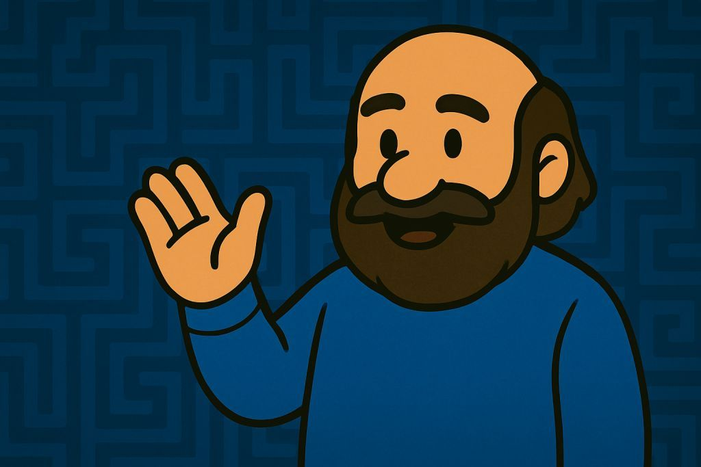

# 🪑 Poincaré — The Retired Hero

Ah... another brave soul.

Let me test your worth.  
**“Every simply connected, closed 3-manifold is homeomorphic to the 3-sphere.”**  
You ready to take on this beast?

😏 Oh wait...  
I already solved it.

---

## 🧠 Millennium Riddle: SOLVED

That’s right. The **Poincaré Conjecture**.  
It stood tall for **over a century**, mocking the minds of math’s greatest.

Until I arrived.

> **Name:** Grigori Perelman  
> **Occupation:** Reclusive Wizard of Geometry  
> **Weapon:** Ricci Flow & Topological Surgery 🔪🧠

I cracked the riddle.  
Then they tried to hand me a **$1 million prize**.  
I said: *No thanks.*

📈 And strangely… my fame skyrocketed.  
I may have lost a million bucks,  
but I gained the ability to attract...  
let’s say... a **wider range of magical acquaintances.** ✨😎

---

## 🧾 Historical Footnote

Even **PSBigBig** came back one day to challenge this solved domain.  
His theory was wild... cosmic even.  
But I was already sipping tea with a mathematician... or two.

---

## 🧘‍♂️ Status: Retired

No more challenges here.  
Just old scrolls, echoes of applause, and a chair that rocks.

---

## 👋 Oh… you're not here to solve anything?

You’re just... exploring folders?  
Clicking around, looking for shiny loot?

*Tsk.*

I thought maybe you were early to my **private post-proof party**.  
(I hear the **Beauty Sorceresses** might show up…)

*Turns away slowly.*

> “I don’t blame you.  
> Not everyone gets to retire as a living legend.”

